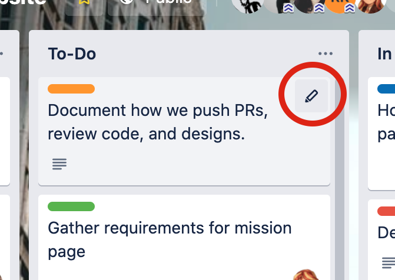
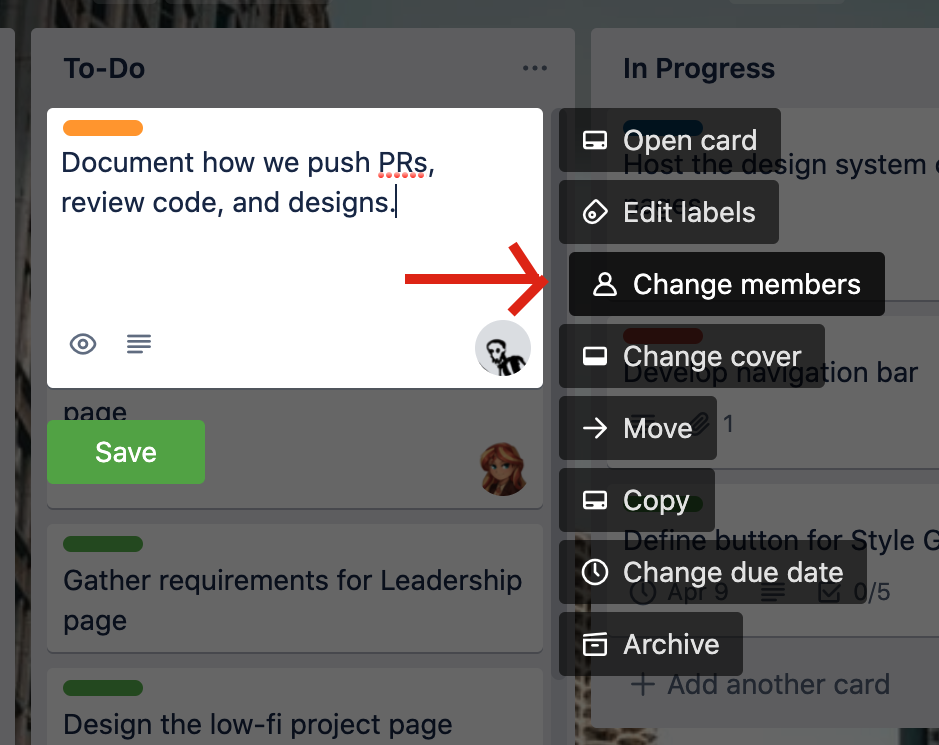
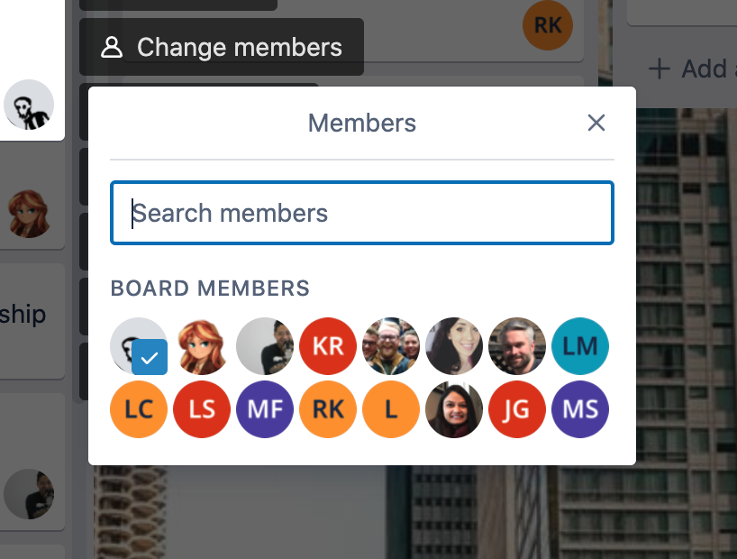
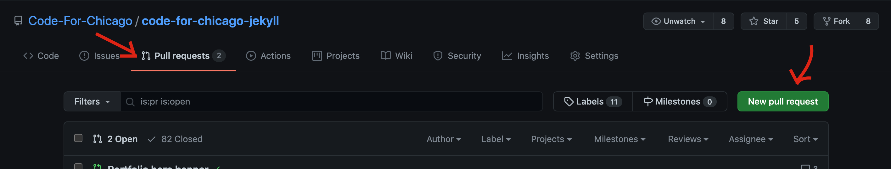
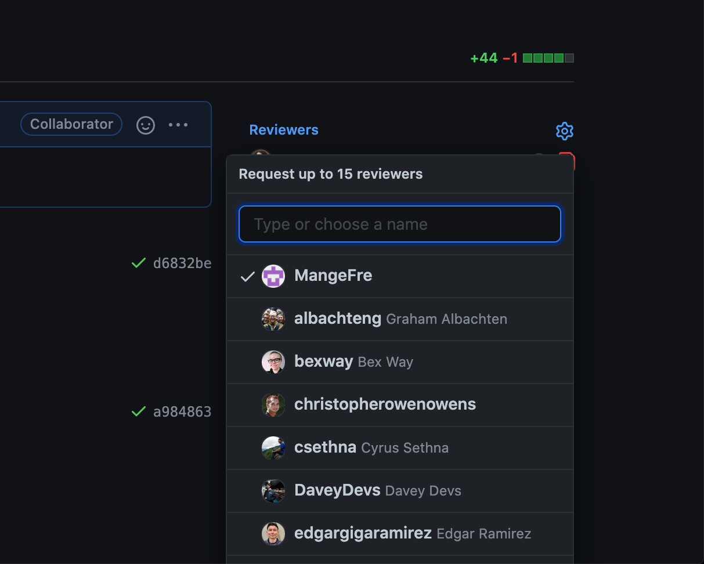
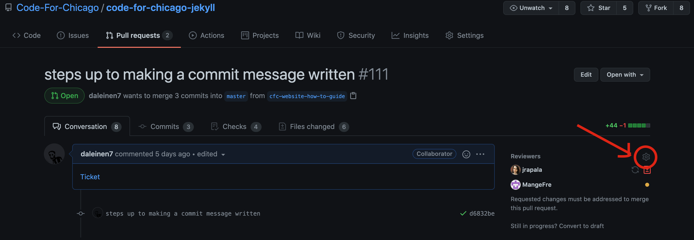
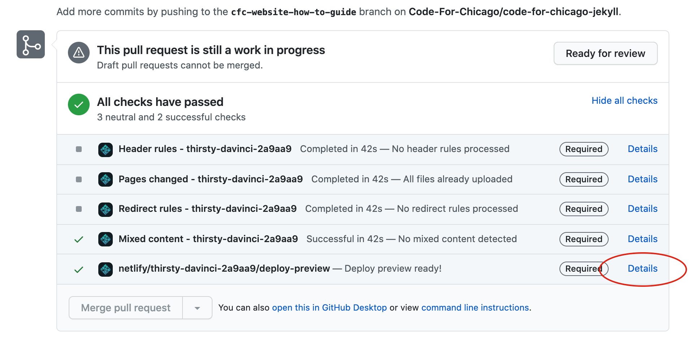

# How to Contribute to the Code for Chicago Website Project
Here are the steps to guide you through the process of contributing to the CfC Website. 

1. Find a Trello card in the "To-Do" column you want to take on. Assign your name to it by clicking the pencil icon in the top right of the card when you hover over it. 



Click "Change Member" and add yourself. 




2. Move the card to the "In Progress" Column. 

3. Make a new branch. ```git checkout -b <branch-name>``` Usually the branch name is named after the feature you are adding.

4. Do your coding magic. 

5. When you are ready to commit the changes; in your terminal type
``` git add -A``` to stage your changes and ```git commit -m "Message on what changes you've made"```to make the commit. 
If this is the first commit you've made to this branch you will need to ```git push --set-upstream origin <branch-name>```
Otherwise if you've already set the upstream you can just ```git push```

6. Once you are ready to open a pull request go to https://github.com/Code-For-Chicago/code-for-chicago-jekyll/ and if you are lucky there will be a yellow notice offering you to "Compare & pull request".

If it's not there you can go to the "Pull Requests" tab at the top, click the green "New Pull Request" button, and select your branch in the right branch dropdown. Then click "Create Pull Request"


7. You should get a green checkmark saying "Able to Merge".

If you are not able to merge, then you'll need to merge the main branch into your branch and solve any merge conflicts.

8. Add a link to the trello ticket in the notes and click "Create pull request". 

9. Move the Trello card from "In Progress" to "Code Review".

10. In the GitHub pull request, you can add reviewers by clicking the gearbox next to the "Reviewers" section on the right. You can request reviewers to look at your changes. Reviewers will review your PR and either give feedback or approve it. Repeat steps 4-9 if changes are requested. 



11. Once you receive approval on your PR, you'll now go into the design QA phase. This is necessary for any changes that were made to the UI, but can be skipped if no visible changes were made. Move the Trello ticket to the "Test/Review" column and add a link to Trello card of the deployed version of your branch. 

You can get this link by looking at the bottom of your pull request and finding the bottom check which will be labeled something like "netlify/thirsty-davinci-2a9aa9/deploy-preview". The "details" link next to it is the link you want."

12. If you pass design QA, then you are ready to merge your branch! Go ahead and merge to master. If you have any merge conflicts, you'll need to resolve those first. If you do not pass design QA and need to make some extensive changes, it's best to go through steps 4-12 once again. Move the Trello card back to "In Progress" if that's the case.