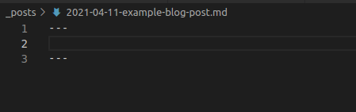
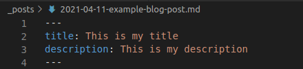
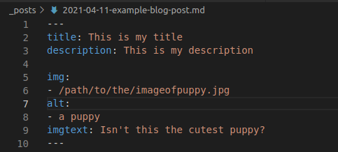
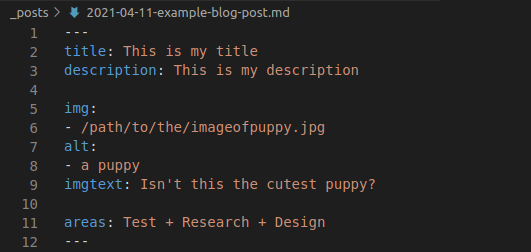
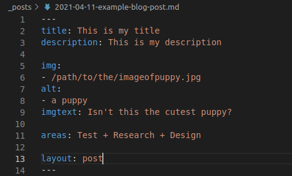
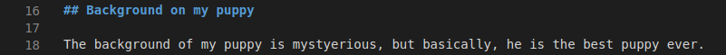
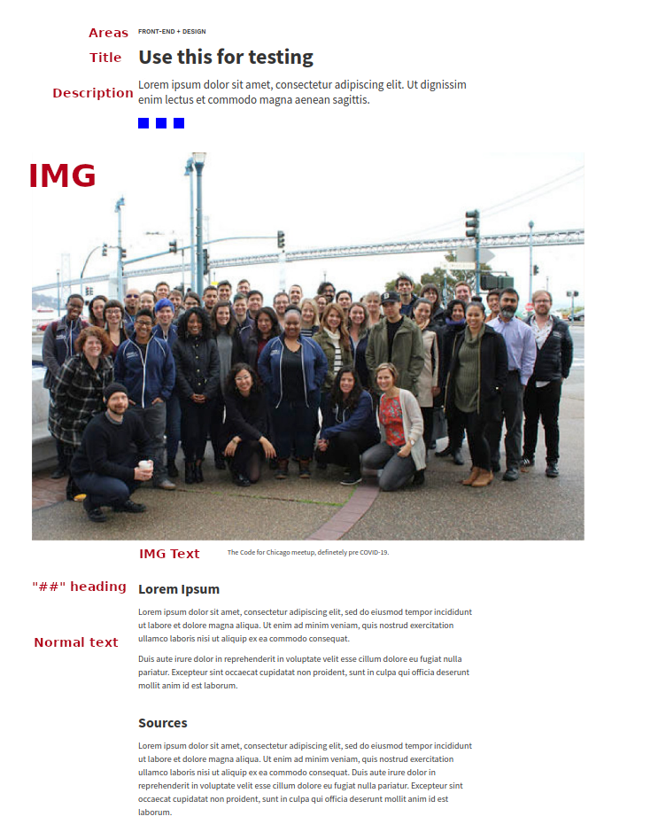

# How to write a post for Code For Chicago

This guide will teach you everything you need to know about how to write a blog post for Code For Chicago, and have it appear on the portfolio page on the website. All posts are written using Markdown. If you're not familiar with Markdown, you can find a very simple look-up guide  [here](https://daringfireball.net/projects/markdown/syntax). You will not need any extensive knowledge of Markdown to write a post, just follow these steps down below.

1. Create your post.

Your post will need to be a Markdown file, and it has to be located in the "_posts" directory.

2. Name your post.

Your post should have its name start with the date of the article, written in the form of "yyyy-mm-dd".
Following the date, you can add a name to the post. Use dashes instead of spaces for separating words.
Full Example: "2021-04-11-this-is-my-post.md"

3. Add all the required information

For the post to appear with a title, description, and other extras, there needs to be some information added at the top of the markdown file.

Start by adding three dashes at the top of the file, and then adding three more dashes below them. This will mark the area where we can
enter information that will show up in the website card.

To create a title, simple add a "title" field and enter your desired name. Same goes for the description.

If you want an image to show up in the portfolio page, you add an "img", "imgtext" and an "alt" field. The "img" field needs a filepath to an image, the "imgtext" is the text that will be displayed under the image once the post is being viewed. The "alt" is text displayed in case the image isn't being loaded, or if a person with visual disabilities is visiting the page. It should describe the image and be kept short.

To display the different areas of the project that CFC worked on, you use the "areas" field. See the image below:

Finally, add the last field, which is the layout. The layout is always post.

Now, we're ready to actually write our content.

4. Add content to your post.

Writing a sub-headline in the blog post is easy. You create a h2 title using "##" and then writing your title. Don't use any other level of subheading (for example, don't use "###" or "####").

If you want to add more images, or links, use the Markdown syntax for adding such things. Check the Markdown guide above. For any natural line break, you can simply use natural line breaks to break up the text.

5. You're all set!

Commit the file into the repository and launch your blog post! All your finished additions will be mapped just like in this example.

The "alt" text does not show up in the post - it is only used by the browser. For example, if the image does not load correctly, the alt text will be displayed instead. Make sure it is descriptive!